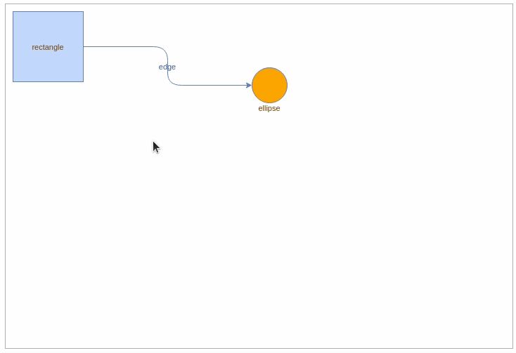
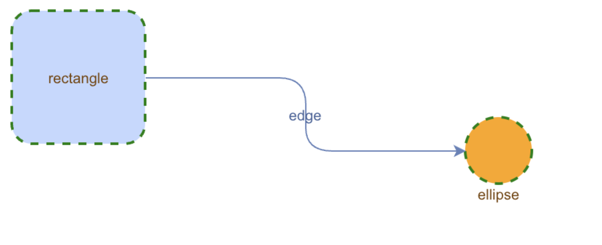

import Tabs from '@theme/Tabs';
import TabItem from '@theme/TabItem';

# Getting Started

## The `maxGraph` Package

### Obtaining `maxGraph`

`maxGraph` is available from the <a href="https://github.com/maxGraph/maxGraph">GitHub project</a>.
Released versions are following [semantic versioning](https://semver.org/).

The content of each release is documented on the [maxGraph releases](https://github.com/maxGraph/maxGraph/releases) GitHub page.

## Installation
[//]: # (extract of <rootdir>/README.md)
Install the latest version of `maxGraph` from the [npm registry](https://www.npmjs.com/package/@maxgraph/core).

<Tabs>
  <TabItem value="npm" label="npm" default>
    ```bash
    npm install @maxgraph/core
    ```
  </TabItem>
  <TabItem value="pnpm" label="pnpm">
    ```
    pnpm add @maxgraph/core
    ```
  </TabItem>
  <TabItem value="yarn" label="yarn">
    ```bash
    yarn add @maxgraph/core
    ```
  </TabItem>
</Tabs>

[//]: # (END OF 'extract of <rootdir>/README.md')


## Basic Usage

### Setting up your first graph

[//]: # (extract of <rootdir>/README.md)

Here is an example that shows how to display a rectangle connected to an orange circle.

This example assumes that:

- you are building an application that includes the `maxGraph` dependency, and it has been installed as explained above.
- your application uses a build tool or a bundler for its packaging. Direct usage of `maxGraph` in a web page is not supported.
- your application includes a page that defines an element with the id graph-container.
you want to use TypeScript, adapt it if you want to use JavaScript (mainly, remove references to the 'type' syntax).


```typescript
import {type CellStyle, Graph, InternalEvent} from '@maxgraph/core';
// Make sure you have element with id 'graph-container' in your HTML
const container = <HTMLElement>document.getElementById('graph-container');
// Disables the built-in context menu
InternalEvent.disableContextMenu(container);

const graph = new Graph(container);
graph.setPanning(true); // Use mouse right button for panning
// Gets the default parent for inserting new cells.
// This is normally the first child of the root (ie. layer 0).
const parent = graph.getDefaultParent();

// Adds cells to the model in a single step
graph.batchUpdate(() => {
  const vertex01 = graph.insertVertex({
    parent,
    position: [10, 10],
    size: [100, 100],
    value: 'rectangle',
  });
  const vertex02 = graph.insertVertex({
    parent,
    position: [350, 90],
    size: [50, 50],
    style: {
      fillColor: 'orange',
      shape: 'ellipse',
      verticalAlign: 'top',
      verticalLabelPosition: 'bottom',
    },
    value: 'ellipse',
  });
  graph.insertEdge({
    parent,
    source: vertex01,
    target: vertex02,
    value: 'edge',
    style: {
      edgeStyle: 'orthogonalEdgeStyle',
      rounded: true,
    },
  });
});
```
If you paste this code into your application, you should have minimal graph displayed with a rectangle connected to an orange circle.



[//]: # (END OF 'extract of <rootdir>/README.md')

### Key Concepts

#### Graph Model
The graph model represents the structure of your graph. It is the foundation of `maxGraph` and manages three primary elements: vertices, edges, and groups.

#### Vertices
Vertices are the fundamental elements of your graph that represent individual nodes or objects. They can contain labels, data, and visual properties. \
Each vertex can be styled independently with different shapes, colors, sizes, and other visual attributes.

Vertices serve as connection points for edges and can be either standalone or part of a group. They are typically used to represent entities in your diagram, such as process steps in a flowchart, nodes in a network diagram, or components in an architectural diagram.

#### Edges
Edges are the connections in your graph that typically represent relationships or flows. While edges commonly connect two vertices (a source and a target),
they can also exist as "dangling" edges - edges that are connected to only one vertex or even no vertices at all. \
This flexibility allows for various use cases such as partially completed diagrams, interactive drawing scenarios, or representing incomplete connections.

Edges can be styled with different line styles, colors, and thicknesses, and can optionally include labels or weights.
They can be directed (showing flow in one direction) or undirected. Common uses include showing data flow in process diagrams, dependencies in architectural diagrams, or relationships in organization charts.

#### Groups
Groups in `maxGraph` allow you to logically organize and structure your graph elements. \
A group is essentially a parent cell (typically a vertex) that can contain other cells (vertices and edges) as its children, creating what's sometimes called a sub-graph. \
Think of groups like folders in a file system - they help organize and manage related elements together.

Groups enable several powerful features in maxGraph:
- Hierarchical organization of your graph elements
- Ability to collapse/expand sections of your graph
- Collective operations on multiple related elements
- Creation of complex nested structures
- Visual separation of different logical components

For example, you might use groups to:
- Create swimlanes in a business process diagram
- Organize related components in a system architecture
- Bundle connected nodes in a network diagram
- Structure departments in an organization chart


### Basic Operations

1. **Adding Vertices**:
```javascript
const vertex01 = graph.insertVertex({
    parent,
    position: [10, 10], // 0,0 is the top-left corner. So this is 10 pixels from the top and 10 pixels from the left.
    size: [100, 100], // width and height of your vertex
    value: 'rectangle', // The text to display in the vertex
});
```

2. **Adding Edges**:
```javascript
  graph.insertEdge({
    parent,
    source: vertex01, // Source vertex
    target: vertex02, // Second vertex that edge should point to
    style: {
      edgeStyle: 'orthogonalEdgeStyle',
      rounded: true,
    },
  });
```

3. **Handling Events**:
```javascript
// This code adds two listeners, one for click and one when some cell is moved
graph.addListener(InternalEvent.CLICK, (sender, evt) => {
  const cell = evt.getProperty('cell');
  if (cell) {
    // Handle cell click
    console.log('Clicked cell:', cell);
  }
});
graph.addListener(InternalEvent.CELLS_MOVED, (sender, evt) =>{
    const cells = evt.getProperty('cells');
    console.log(`Number of cells moved is: ${cells.length}`);
})
```

### Styling

`maxGraph` supports  styling both vertices and edges. Here is an example of how to apply a default style to vertex.

To extend the example from setting up your first graph, let's add some styling to the vertices.

```javascript
// Put this code when initializing graph, before any insertVertex call has been made.
const vertexStyle = graph.getStylesheet().getDefaultVertexStyle();
vertexStyle.rounded = true;
vertexStyle.dashed = true;
vertexStyle.strokeWidth = 2;
vertexStyle.strokeColor = 'green';
```

Your vertices will now have a dashed green border with a width of 2 pixels.




## Need Help?
[//]: # (extract of <rootdir>/README.md)

- For usage question, please open a new [discussion](https://github.com/maxGraph/maxGraph/discussions/categories/q-a) on GitHub. You can also use
[GitHub discussions](https://github.com/maxGraph/maxGraph/discussions) for other topics like `maxGraph` development or to get the latest news.
- For bug reports, feature requests, or other issues, please open a new [issue](https://github.com/maxGraph/maxGraph/issues) on GitHub.

[//]: # (END OF 'extract of <rootdir>/README.md')
