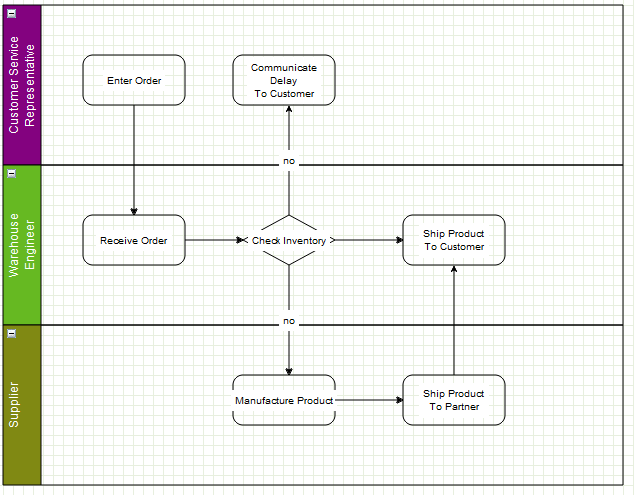

# Cells

:::note

This manual is licensed under [Creative Commons Attribution 4.0 International (CC BY 4.0)](https://creativecommons.org/licenses/by/4.0/). \
It is adapted from the original [mxGraph manual](https://github.com/jgraph/mxgraph/blob/v4.2.2/docs/manual.html).

> Copyright 2021-present The maxGraph project Contributors \
Copyright (c) JGraph Ltd 2006-2020

:::


## The `Cell` object

`Cell` is the cell object for both vertices and edges. `Cell` duplicates many of the functions available in the model.
The key difference in usage is that using the model methods creates the appropriate event notifications and undo, using the cell makes the change but there is no record of the change.
This can be useful for temporary visual effects such as animations or changes on a mouse over, for example.
As a general rule though, use the model editing API unless you encounter a specific problem with this mechanism.

When creating a new cell, three things are required in the constructor, a value (user object), a geometry and a style.
We will now explore these 3 concepts before returning to the cell.


## Styles

:::warning

Style Mechanism Changes

The screenshots in this section show the legacy `mxGraph` style mechanism. In `maxGraph`:
- Styles are now defined as objects instead of strings
- Properties are accessed directly through object notation
- The visual representation will be updated in future documentation

See the [Migrate from mxGraph](../usage/migrate-from-mxgraph.md#styling) guide for detailed migration instructions.
:::

The concept of styles and stylesheets in conceptually similar to CSS stylesheets, though note that CSS are actually used in `maxGraph`, but only to affect global styles in the DOM of the HTML page.
The style properties in maxGraph are defined in [CellStateStyle](https://maxgraph.github.io/maxGraph/api-docs/types/CellStateStyle.html) and [CellStyle](https://maxgraph.github.io/maxGraph/api-docs/types/CellStyle.html) objects.

Some of the styles apply to vertices, some to edges and some to both. As you can see, these define visual attributes on the element they act upon.

The Stylesheet holds a Map that associates style names with style objects:


_Style properties within the styles collection_


In the above image the blue box represents the styles object in `StyleSheet`. For example, the string 'defaultVertex' is the key to a style object.

Note that `maxGraph` creates two default styles, one for vertices and one for edges.
If you look back to the [hello world example](../tutorials/the-hello-world-example.md), no style was passed into the optional style parameter of `insertVertex` or `insertEdge`.
In this case the default style would be used for those cells.


<a id="setting_cell_style"></a>
### Setting the Style of a Cell

If you wanted to specify a style other than the default for a cell, you must pass that new style either to the cell when it is created
(`insertVertex` and `insertEdge` both have an optional parameter for this) or pass that style to the cell using `GraphDataModel.setStyle()`.

The style that you pass has the form style name, and it must be stored in the `baseStyleNames` property of the `CellStyle` object representing the entire style.
Note that the base style names and the other style properties may be in any order.

Below are examples to demonstrate this concept, adapting the `insertVertex` call we saw in the [hello world example](../tutorials/the-hello-world-example.md):
- A new style called _ROUNDED_ has been created, to apply this to a vertex:
```javascript
const v1 = graph.insertVertex(parent, null, 'Hello', 20, 20, 80, 30,
    {
      baseStyleNames: ['ROUNDED'],
    });
```
- To create a new vertex with the _ROUNDED_ style, overriding the stroke and fill colors:
```javascript
const v1 = graph.insertVertex(parent, null, 'Hello', 20, 20, 80, 30,
    {
      baseStyleNames: ['ROUNDED'],
      strokeColor: 'red',
      fillColor: 'green',
    });
```
- To create a new vertex with no global style, but with local stroke and fill colors:
```javascript
const v1 = graph.insertVertex(parent, null, 'Hello', 20, 20, 80, 30,
    {
      ignoreDefaultStyle: true,
      strokeColor: 'red',
      fillColor: 'green',
    });
```
- To create a vertex that uses the _defaultVertex_ style, but a local value of the fill color:
```javascript
const v1 = graph.insertVertex(parent, null, 'Hello', 20, 20, 80, 30,
  {
    baseStyleNames: ['defaultVertex'], // This can be ommited, as it is the default style applied for vertices
    fillColor: 'blue',
  });
```

Again, the `maxGraph` class provides utility functions that form the core API for accessing and changing the styles of cells:

**Core API functions:**
- **Graph.setCellStyle(style, cells)**: Sets the style for the array of cells, encapsulated in a begin/end update.
- **Graph.getCellStyle(cell)**: Returns the style for the specified cell, merging the styles from any local style and the default style for that cell type.


### Creating a New Global Style

To create the _ROUNDED_ global style described above, you can follow this template to create a style and register it with `StyleSheet`:

```javascript
const style = {
  shape: 'rectangle',
  opacity: 50,
  fontColor: '#774400',
};
graph.getStylesheet().putCellStyle('ROUNDED', style);
```


## Geometry

In the [hello world example](../tutorials/the-hello-world-example.md), we saw the position and size of the vertices passed into the `insertVertex` function.
The coordinate system in JavaScript is `x` is positive to the right and `y` is positive downwards, and in terms of the graph, the positioning is absolute to the container within which the `maxGraph` is placed.

The reason for a separate `Geometry` class, as opposed to simply having the `Rectangle` class store this information, is that the edges also have geometry information.

The `width` and `height` values are ignored for edges and the `x` and `y` values relate to the positioning of the edge label.
In addition, edges have the concept of **control points**. These are intermediate points along the edge that the edge is drawn as passing through.
The use of control points is sometimes referred to as **edge routing**.


_An edge routed by 2 control points_

There are two more important additional concepts in geometry, relative positioning and offsets, which are described in the following sections.


### Relative Positioning

By default, the `x` and `y` position of a vertex is the offset of the top left point of the bounding rectangle of the parent to the top left point of the bounding rectangle of the cell itself.
The concept of parents and groups is discussed later in this chapter, but without going into too much detail, if a cell does not have cell parent, the graph container is its parent for positioning purposes.


_Non-relative vertex positioning_


For an edge, in non-relative mode, which is the default mode, the edge label position is the absolute offset from the graph origin.


_Non-relative edge label positioning_


For vertices in relative mode, `(x, y)` is the proportion along the parent cell's (width, height) where the cell's origin lies.
(0, 0) is the same origin as the parent, (1, 1) places the origin in the bottom right corner of the parent.
The same relative positioning extends below 0 and above 1 for both dimensions. This positioning is useful for keeping child cells fixed relative to the overall parent cell size.


_Relative vertex positions_

Lastly, edge labels in relative mode are placed based on the positioning from the center of the edge.
The x-coordinate is the relative distance from the source end of the edge, at -1, to the target end of the edge, at 1.
The y co-ordinate is the pixel offset orthogonal from the edge.

The diagram below shows the values of `x,y` for various edge labels in relative mode.
Note that for a straight edge, the calculations are simple.
For edges with multiple control points, the edge has to be traced along its segments (a segment being the line between end points and/or control points) to find the correct distance along the edge.
The `y` value is the orthogonal offset from that segment.

Switching relative positioning on for edge labels is a common preference for applications. Navigate to the `Graph.insertEdge()` function in `maxGraph`, you will see this calls `createEdge()`.
In createEdge() the geometry is set relative for every edge created using this prototype.
This is partly the reason for the amount of helper functions in `Graph`, they enable easy changing of the default behaviour. \
You should try to use the `Graph` class API as much as possible to provide this benefit in your applications.


### Offsets

The offset field in Geometry is an absolute `x,y` offset applied to the cell **label**.
In the case of edge labels, the offset is always applied after the edge label has been calculated according to the relative flag in the above section.

**Core API functions:**

- **Graph.resizeCell(cell, bounds)** - Resizes the specified cell to the specified bounds, within a begin/end update call.
- **Graph.resizeCells(cells, bounds)** - Resizes each of the cells in the cells array to the corresponding entry
  in the bounds array, within a begin/end update call.


## User Objects

The _User Object_ is what gives `maxGraph` diagrams a context, it stores the business logic associated with a visual cell.
In the [hello world example](../tutorials/the-hello-world-example.md), the user object has just been a string, in this case it simply represents the label that will be displayed for that cell. \
In more complex applications, these user objects will be objects instead.
Some attribute of that object will generally be the label that the visual cell will display, the rest of the object describes logic relating to the application domain.

Using the example of a simple workflow or process application, say we have the graph below:




_A simple workflow_


Typically, this workflow will exist on some application server and/or database.
The browser user connects to that server, or some front-end server linked to the application server and the user's web application requests the "order" workflow.
The server obtains the data of that workflow and transmits it to the client.

`maxGraph` supports the process of populating the model on the server-side and transmitting to the client, and back again.
See the later chapter on [I/O and Server Communication](../tutorials/editor-input-output.md).

The data transmitted will be both the visual model (the diagram) and the business logic (mostly contained in the user objects).
The client will initially show the diagram above. If the user has permission to edit this workflow they will normally be able to do two things:
1. edit the diagram, add and remove vertices, as well as changing the connections
2. edit the user objects of the cells (vertices and/or edges).


:::warning
The following demo is currently not available in `maxGraph`. See the original [workfloweditor](http://www.jgraph.com/demo/mxgraph/editors/workfloweditor.html) `mxGraph` demo for now.
:::
In the online demo, if you right-click and select properties of the "Check Inventory" diamond you will see this dialog:


_The properties of a vertex_

These properties show the geometry, label, ID etc., but a dialog could just as easily show the user object of the cell.
There might be a reference to some process on the workflow engine as to how the inventory is actually checked.
This might be an application specific mechanism for both the server and client to assign some identification to remote method calls. \
Another value might be the type of object that process returned, maybe a boolean or an integer to indicate stock level in this case.
Given that return type, it is possible to enforce constraints with the diagram and provide visual alerts of if, say, the outgoing edges decision check does not correspond to the return type of the vertex.

Next, as an example, the user objects of the outgoing edges might contain a label and a boolean state.
Again, the `maxGraph`-based editor might provide the means to alter the boolean value.
On the server, when executing the process, it might follow the edges that correspond to the boolean value returned by the decision node.

Keep in mind that the above example is very domain specific, it is there to explain how the user object maps to the business logic of the application.
It visualizes how `maxGraph` creates what we term a **contextual graph**. The context is formed by the connections between vertices and the business logic stored within the user objects. \
A typical application receives the visual and business logic from a sever, may allow editing of both, then transmits both back to the server for persistence and/or execution.


## Cell Types

As described previously, `Graph` is the primary API for using this library and the same concept applies to cells.
One basic state of the cell not exposed on the graph is whether a cell is a vertex or an edge, this call be performed on the cell or on the model.

There are two boolean flags on `Cell`, vertex and edge, and the helper methods set one of these to true when the cell is created.
`isVertex()` and `isEdge()` on GraphDataModel are what the model uses to determine a cell's type, there are no separate objects for either type.
Technically, it is possible to switch the type of cell at runtime, but take care to invalidate the cell state (see later section) after changing the type. \
Also, be aware that the geometry object variable means different things to vertices and edges. Generally, it is not recommended to change a cell type at runtime.
