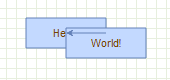

# Group and Complexity

:::note

This manual is licensed under [Creative Commons Attribution 4.0 International (CC BY 4.0)](https://creativecommons.org/licenses/by/4.0/). \
It is adapted from the original [mxGraph manual](https://github.com/jgraph/mxgraph/blob/v4.2.2/docs/manual.html).

> Copyright 2021-present The maxGraph project Contributors \
Copyright (c) JGraph Ltd 2006-2020

:::

## Group Structure

Grouping, within `maxGraph`, is the concept of logically associating cells with one another.
This is commonly referred to as the concept of sub-graphs in many graph toolkits.
Grouping involves one or more vertices or edges becoming children of a parent vertex or edge (usually a vertex) in the graph model data structure.
Grouping allows `maxGraph` to provide a number of useful features:
- Sub-graphs, the concept of a logically separate graph that is displayed in the higher level graph as a cell per sub-graph.
- Expanding and collapsing, the ability to replace a collection of grouped cells visually with just their parent cell. Expanding is the reverse of this.
  This behaviour can be seen by clicking the small "-" in the top left corner of the group cells of the swimlanes example in the [online workfloweditor](http://www.jgraph.com/demo/mxgraph/editors/workfloweditor.html) example.
  This is described in the _Complexity Management_ section below.
- Layering, the concept of assigning cells to a particular z-order layer within the graph display.
- Drill down, step up, these concepts allow sub-graphs to be visualized and edited as if they are a complete graph. In the _User Objects_ section we saw the "check inventor" vertex as a single cell.
  Take, for example, the case where a developer is describing each of the vertices in the process as the software processes that perform the task.
  The application might have an option to drill down into the "check inventory" vertex. This would result in a new graph appearing that describes in detail how exactly the system checks the inventory.
  The graph might have the title of the parent "check inventory" vertex to indicate it is a child, as well as the option to step-up back to the next level up.

In grouping, cells are assigned a parent cell. In the simplest case, all cells have the default parent as their parent. \
The default parent is an invisible cell with the same bounds as the graph.
This is the cell returned by graph.getDefaultParent() in the [hello world example](../tutorials/the-hello-world-example.md). \
The `x,y` position of a vertex is its position relative to its parent, so in the case of default grouping (all cells sharing the default parent) the cell positioning is also the absolute co-ordinates on the graph
component. \
In the case all cells being added to the default root, the group structure logically looks like, in the case of the [hello world example](../tutorials/the-hello-world-example.md), the diagram below.

Note the addition of the `Layer 0` cell, this is the default indirection in the group structure that allows layer changes with the requirement of additional cells. \

We include it below for correctness, but in later group diagrams it will be omitted.

_The group structure of the "hello world" example_

Also, note that the position of the edge label (x,y in geometry) is relative to the parent cell.

If we go back to the simple workflow example in the _User Objects_ section, we can see what grouping might look like visually. \
In the example the group cells represent people and the child vertices represent tasks assigned to those people. In this example the logical group structure looks like this:

_The logical group structure of the workflow example_

The workflow action vertices are the yellow children and the swimlane group vertices are marked blue.

Inserting cells into the group structure is achieved using the parent parameter of the `insertVertex` and `insertEdge` functions on the `Graph` class.
These functions set the parent cell on the child accordingly and, importantly, informs the parent cell of its new child.

Altering the group structure is performed via the `Graph.groupCells()` and `Graph.ungroupCells()` functions.

**Core API functions:**

- **Graph.groupCells(group, border, cells)**: Adds the specified cells to the specified group, within a begin/end update
- **Graph.ungroupCells(cells)**: Removes the specified cells from their parent and adds them to their parent's parent.
  Any group empty after the operation are deleted. The operation occurs within a begin/end update.

## Complexity Management

There are two primary reasons to control the number of cells displayed at any one time:
- The first is performance, drawing more and more cells will reach performance usability limits at some point on any platform.
- The second reason is ease of use, a human can only comprehend a certain amount of information.

All the concepts associated with grouping, listed above, can be used to reduce the complexity of information on the screen for the user.

### Folding

Folding refers to the ability to expand or collapse groups of cells:
- **Collapsing** a group hides its child vertices and shows a simplified representation
- **Expanding** a group reveals all its child vertices and their connections

This feature is controlled through several functions:

**Core API function:**
- **Graph.foldCells(collapse, recurse, cells)**: States the collapsed state of the specified cells, within a begin/end update.

**Folding related functions:**
- **Graph.isCellFoldable(cell, collapse)**: By default `true` for cells with children.
- **Graph.isCellCollapsed(cell)**: Returns the folded state of the cell.

When a group cell is collapsed, three things occur by default:
- The children of that cell become invisible.
- The group bounds of the group cell is used. Within Geometry there is a alternativeBounds field and in groups cells, by default store a separate bounds for their collapsed and expanded states.
  The switch between these instances is invoked by `Graph.swapBounds()` and this is handled for you within a `foldCells()` call. \
  This allows collapsed groups to be resized whilst when expanded again the size looks correct using the pre-collapsed size.
- Edge promotion occurs, by default. Edge promotion means displaying edges that connect to children within the collapsed group that also connect to cells outside the collapsed group, by making them appear to connect to the collapsed parent.

_Expanded swimlane_

_Collapsed swimlane_

The above two images demonstrate these three concepts. \
In its expanded state the upper group cell displays a small box in the top left hand corner with a "-" character inside.
This indicates that clicking on this box collapses the group cell. Doing this we get the bottom image where the group cell takes on its collapsed size.
Child vertices and edge that do not leave the group cell are made invisible. \
Finally, edges that exit the group cell are promoted to appear to be connected to the collapsed group cell.
Clicking on the "+" character that now appears within the box expands the group cell and brings it back to its original state of the top image.

Using the `Graph.foldCells()` function, you can achieve the same result programmatically as clicking on the expand/collapse symbols.
One common usage of this is when the application zooms out a specific amount, clusters of cells are grouped and the grouped cell collapsed (very often without the ";" box since the application is controlling the folding). \
This way fewer, larger cells are visible to the user, each one representing their children cells logically.
You might then provide a mechanism to zoom into a group, which expands it in the process. You might also provide drill-down/step-up, explained next.

### Sub-Graphs, Drill-Down / Step-Up

Sometimes, as an alternative to expand/collapse, or possibly in combination with it, your graph will be composed of a number of graphs, nested into a hierarchy. \
Below we see a simple example:

_An example top level workflow_

This simple workflow consists of three high level steps.
Obviously, the individual steps contain a number of sub-steps, and we will look at a sub-graph of the <em>Solve Bug</em> cell.

Under the _Solve Bug_ vertex we have created a number of children to represent the process of solving a bug in more detail, in this case the process of solving a bug on the [Starship Enterprise](http://en.wikipedia.org/wiki/Starship_Enterprise).

In this example, which uses the GraphEditor example, the menu option shown selected in the above image invokes `Graph.enterGroup(cell)`, which is one of the pair of core API functions for sub-graphs.

**Core API functions:**

- **Graph.enterGroup(cell)**: Makes the specified cell the new root of the display area.
- **Graph.exitGroup()**: Makes the parent of the current root cell, if any, the new root cell.
- **Graph.home()**: Exits all groups, making the default parent the root cell.

The root cell of the graph has been, up to now, the default parent vertex to all first-level cells.
Using these functions you can make any group cell in the group structure the root cell, so that the children of that parent appear in the display as the complete graph.

_Result of drilling down into the Solve Bug vertex_

The same graph expanded using folding instead looks like:

Exiting the group using the _shape->exit group_ option, which invokes `Graph.exitGroup`, brings you back to the original 3 vertex top level graph.

### Layering and Filtering

In `maxGraph`, like many graphical applications, there is the concept of z-order. \
That is, the order of objects as you look into the screen direction. Objects can be behind or in front of other objects and if they overlap and are opaque then the back-most object will be partially or complete obscured.
Look back to the graph structure of [HelloWorld illustration above](#group-structure).
Children cells are stored under parents in a deterministic order (by default the order in which you add them).

If we move the cells in the [hello world example](../tutorials/the-hello-world-example.md) we see the following result:

_Overlapped vertices_

It can be seen that the _World_ vertex is in front of the _Hello_ vertex.
This is because the _World_ vertex has a higher child index than the _Hello_ vertex, at positions 1 and 0 respectively in the ordered collection that holds the children of the root cell.

To change order we use `Graph.orderCells`.
- **Graph.orderCells(back, cells)**: Moves the array of cells to the front or back of their siblings, depending on the flag, within a begin/end update.

A sibling cell in `maxGraph` is any cell that shares the same parent. So by invoking this on the _Hello_ vertex it would then overlap the _World_ Vertex.

Ordering and grouping can be extended to form logically layered groups.
The cells are drawn via a depth-first search. \
Take the [hello world example](../tutorials/the-hello-world-example.md) again and imagine that both the _Hello_and _World_ vertices have some hierarchy of children underneath them. \
The _Hello_ vertex and all of its children will be drawn before the _World_ vertex or any of its children. \
If _Hello_ and _World_ were invisible group cells you then have two hierarchies of cells, one being drawn entirely before the other.
You can also switch the order of the hierarchies by simply switching the order of the invisible group cells.

The concept of layering is demonstrated in the [Layers example](https://maxgraph.github.io/maxGraph/demo/?path=/story/layouts-layers--default) (Source: [Layers.stories.js](https://github.com/maxGraph/maxGraph/blob/main/packages/html/stories/Layers.stories.js)).
Here buttons are used to set the visibility of group layer cells. This example ties very closely into the concept of filtering.

In filtering cells with some particular attribute are displayed.
One option to provide filtering functionality is to check some state before rendering the cells. \
Another method, if the filtering conditions are simple and known in advance, is to assign filterable cells by groups. \
Making the groups visible and invisible performs this filtering operation.
