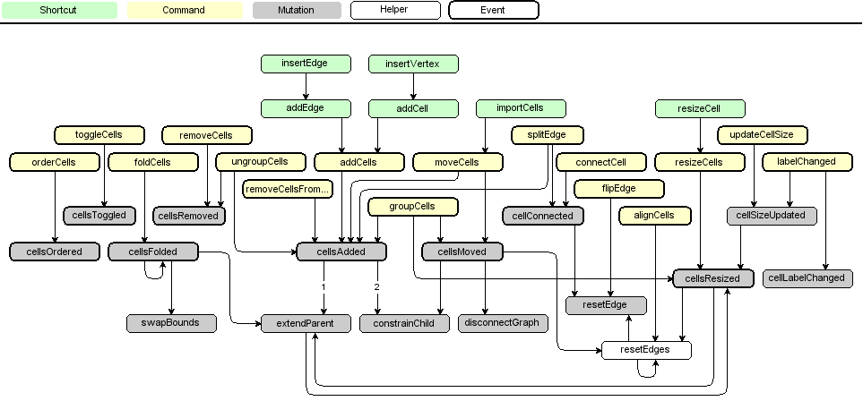

# Graph

:::warning

The content of this page is a **work in progress**.
The original `mxGraph` tutorial was used to create this page which still contains `mxGraph` class diagrams to migrate to the maxGraph API.

:::

:::note

This tutorial is licensed under [Creative Commons Attribution 4.0 International (CC BY 4.0)](https://creativecommons.org/licenses/by/4.0/). \
It is adapted from the original [mxGraph tutorial](https://github.com/jgraph/mxgraph/blob/v4.2.2/docs/tutorial.html).

> Copyright 2021-present The maxGraph project Contributors \
Copyright (c) JGraph Ltd 2006-2017

:::


Instantiate [Graph](https://maxgraph.github.io/maxGraph/api-docs/classes/Graph.html) in order to create a graph. This is the central class in the API.
Everything else is auxiliary.


To create a new graph instance, a DOM node (typically a DIV) is required:

```javascript
const node = document.getElementById('id-of-graph-container');
const graph = new Graph(node);
```

<a id="Model"></a>
## Model

[Cell](https://maxgraph.github.io/maxGraph/api-docs/classes/Cell.html) defines the elements of the graph model, which is implemented by [GraphDataModel](https://maxgraph.github.io/maxGraph/api-docs/classes/GraphDataModel.html).


The graph model has the following properties:
*  The root element of the graph contains the layers. The parent of each layer is the root element.
* A layer may contain elements of the graph model, namely vertices, edges and groups.
* Groups may contain elements of the graph model, recursively.

The graph and structural information is stored in the cells, as well as the _user objects_,
which are used to store the _value_ associated with the cells (aka business objects).

To create a new graph model with a root cell and a default layer (first child):

```javascript
const root = new Cell();
root.insert(new Cell());
const model = new GraphDataModel(root);
```

The method call hierarchy is as follows:



<a id="Stylesheet"></a>
## Stylesheet

The appearance of the cells in a graph is defined by the stylesheet, which is an instance of [Stylesheet](https://maxgraph.github.io/maxGraph/api-docs/classes/Stylesheet.html).
The stylesheet maps from style names to styles.

A style is a [CellStateStyle object ](https://maxgraph.github.io/maxGraph/api-docs/types/CellStateStyle.html), to be used with the cells. 

To modify the default styles for vertices and edges in an existing graph:
```javascript
const vertexStyle = graph.getStylesheet().getDefaultVertexStyle();
vertexStyle.rounded = true;

const edgeStyle = graph.getStylesheet().getDefaultEdgeStyle();
edgeStyle.edgeStyle = EdgeStyle.TopToBottom;
```


<a id="Styles"></a>
## Styles

The style information for a cell is stored in `cell.style`.
The style is part of the cell's state and is normally changed via `GraphDataModel.setStyle`, which will update all views.
The cell style is a [CellStateStyle object ](https://maxgraph.github.io/maxGraph/api-docs/types/CellStateStyle.html) which tells the graph to use the given named styles and override the specified keys. 

For example, use the [Stylesheet.putCellStyle](https://maxgraph.github.io/maxGraph/api-docs/classes/Stylesheet.html#putcellstyle) method to set to `rounded` style
and override the stroke and fill colors, the style would be defined as:

```javascript
{
  baseStyleNames: ['rounded'],
  strokeColor: 'red',
  fillColor: 'green'
}
```

To use the above in Hello, World!, the style name would be passed to the insertVertex method as follows:

[//]: # (TODO migrate to the new insertVertex method using a single object parameter)
```javascript
const v1 = graph.insertVertex(parent, null, 'Hello', 20, 20, 80, 30,
  {
    baseStyleNames: ['rounded'],
    strokeColor: 'red',
    fillColor: 'green'
  }
);
```


<a id="Appearance"></a>
## Appearance

In certain cases you may want to override specific attributes based on dynamic properties of a cell (i.e. it's value, aka. `UserObject`), such as
the image, indicator shape, -image, -color or -gradient color), in which case you can override
`getImage`, `getIndicatorShape`, `getIndicatorImage`, `getIndicatorColor` and `getIndicatorGradientColor` respectively.
Note that these methods take a cell state as an argument, which points to a "resolved" version of the cell's style.

Hence, the default implementation for `getImage`looks as follows:

```typescript
graph.getImage = function(state: CellState) {
  if (state?.style) {
    return state.style.image;
  }
  return null;
}
```

This method may be overridden to return any image for the given state.
Typically, the image is defined by either `state.cell`, which points to the graph cell associated with the state, or by `state.cell.value`,
which refers to the cell's user object.
  
Due to the nature of the display, where all cells are created once and updated only if the model fires a notification for a change,
you must invoke `view.invalidate(cell)` for each cell whose image has changed, and call `view.validate` to update the display.
